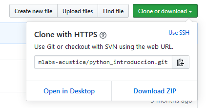

#  Introduction to Python

[](https://nbviewer.jupyter.org/github/infiniemlabs-acustica/python_introduccion)

In this open source repository, it is distributed under the International [Creative Commons BY-SA 4.0](https://creativecommons.org/licenses/by-sa/4.0/deed.es). In it you will find the classes and exercises proposed during the course. All notes, sample codes and exercises are sorted by class.

> If you have already completed the course, autonomously (online) or in person, we are interested in knowing your opinion. We invite you to complete a brief [questionnaire](https://forms.gle/4BAHbXiPn7PGwXKB6).

## Notebooks

All classes of the course are developed in [Jupyter](https://jupyter.org/)  notebooks and located in the `notebooks/` folder. The numbering of notebooks is defined as follows:


To dispose of the material can be done as follows:

**With `git`**
If you have git installed, the easiest way to access these files is to clone the repository in the directory of your choice.

``` bash
git clone https://github.com/infiniemlabs-acustica/python_introduccion.git
```

**Without `git`**
Alternatively, you can download the entire repository as a .zip file from the repository's home page using the green "Clone or download" button in the upper right corner.



> To learn more about git, is the [notebook](notebooks/102_intro_git.ipynb) help.

## Course Dynamics

**The total duration of the course is 12 hours**, divided into 4 classes of 3 hours each. The course aims to be intensive, it was designed to be divided into two theoretical-practical intervals. Each interval includes a short break.
Se propone la siguiente disponsición: 

(30 minutes theory + 50 minutes practice  + 10 recess) * 2 = 3 hours

## Index 

Notebooks can be viewed both online using [nbviewer](https://nbviewer.jupyter.org/)  or locally from the downloaded repository. Below are both links:

* Class I
    * Instalación y configuración del entorno de desarrollo. [[Local]](notebooks/100_instalacion.ipynb) [[Web]](https://nbviewer.jupyter.org/github/infiniemlabs-acustica/python_introduccion/blob/master/notebooks/100_instalacion.ipynb)
    * Introducción a Git. [[Local]](notebooks/101_intro_git.ipynb) [[Web]](https://nbviewer.jupyter.org/github/infiniemlabs-acustica/python_introduccion/blob/master/notebooks/101_intro_git.ipynb)
    * Conceptos básicos de programación. [[Local]](notebooks/102_conceptos_basicos.ipynb) [[Web]](https://nbviewer.jupyter.org/github/infiniemlabs-acustica/python_introduccion/blob/master/notebooks/102_conceptos_basicos.ipynb)
    * Ejercicios. [[Local]](notebooks/103_ejercicio_1.ipynb) [[Web]](https://nbviewer.jupyter.org/github/infiniemlabs-acustica/python_introduccion/blob/master/notebooks/103_ejercicio_1.ipynb)
* Class II 
    * Sintaxis básica. [[Local]](notebooks/200_sintaxis_basica.ipynb) [[Web]](https://nbviewer.jupyter.org/github/infiniemlabs-acustica/python_introduccion/blob/master/notebooks/200_sintaxis_basica.ipynb)
    * Ejercicios. [[Local]](notebooks/201_ejercicio_2.ipynb) [[Web]](https://nbviewer.jupyter.org/github/infiniemlabs-acustica/python_introduccion/blob/master/notebooks/201_ejercicio_2.ipynb)
    * Continuación de sintaxis básica. [[Local]](notebooks/202_sintaxis_basica_continuacion.ipynb) [[Web]](https://nbviewer.jupyter.org/github/infiniemlabs-acustica/python_introduccion/blob/master/notebooks/202_sintaxis_basica_continuacion.ipynb)
    * Ejercicios. [[Local]](notebooks/203_ejercicio_3.ipynb) [[Web]](https://nbviewer.jupyter.org/github/infiniemlabs-acustica/python_introduccion/blob/master/notebooks/203_ejercicio_3.ipynb)
* Class III
    * Estructuras. [[Local]](notebooks/300_estructuras.ipynb) [[Web]](https://nbviewer.jupyter.org/github/infiniemlabs-acustica/python_introduccion/blob/master/notebooks/300_estructuras.ipynb)
    * Ejercicios. [[Local]](notebooks/301_ejercicio_4.ipynb) [[Web]](https://nbviewer.jupyter.org/github/infiniemlabs-acustica/python_introduccion/blob/master/notebooks/301_ejercicio_4.ipynb)     
    * Modulos y funciones. [[Local]](notebooks/302_modulos_funciones.ipynb) [[Web]](https://nbviewer.jupyter.org/github/infiniemlabs-acustica/python_introduccion/blob/master/notebooks/302_modulos_funciones.ipynb)
    * Ejercicios. [[Local]](notebooks/303_ejercicio_5.ipynb) [[Web]](https://nbviewer.jupyter.org/github/infiniemlabs-acustica/python_introduccion/blob/master/notebooks/303_ejercicio_5.ipynb)    
* Class IV
    * Más sobre estructuras. [[Local]](notebooks/400_mas_sobre_estructuras.ipynb) [[Web]](https://nbviewer.jupyter.org/github/infiniemlabs-acustica/python_introduccion/blob/master/notebooks/400_mas_sobre_estructuras.ipynb)
    * Ejercicios. [[Local]](notebooks/401_ejercicio_6.ipynb) [[Web]](https://nbviewer.jupyter.org/github/infiniemlabs-acustica/python_introduccion/blob/master/notebooks/401_ejercicio_6.ipynb)
    * Errores y excepciones. [[Local]](notebooks/402_errores_excepciones.ipynb) [[Web]](https://nbviewer.jupyter.org/github/infiniemlabs-acustica/python_introduccion/blob/master/notebooks/402_errores_excepciones.ipynb)
    * Ejercicios. [[Local]](notebooks/403_ejercicio_7.ipynb) [[Web]](https://nbviewer.jupyter.org/github/infiniemlabs-acustica/python_introduccion/blob/master/notebooks/403_ejercicio_7.ipynb)

> **Note:** each notebook has its well-detailed content index and its pedagogical objectives.

## Authors and collaborators

* [Maximiliano Yommi](https://www.linkedin.com/in/myommi)
* [Fabricio Chungo](https://www.linkedin.com/in/fabricio-chungo-983421b2)
* [Ariel Groisman](https://www.linkedin.com/in/ariel-groisman)

## gitContacts

* Mail: infiniemlab.dsp@gmail.com
* Repository: [GitHub](https://github.com/infiniemlabs-acustica)
* Facebook: [Infiniem Labs - Face](https://www.facebook.com/InfiniemLab)
* WebSite: [Infiniem Labs Acústica](https://infiniemacustica.com/)

## License


The content can be reused, as long as the terms of the [Creative Commons BY-SA 4.0](https://creativecommons.org/licenses/by-sa/4.0/deed.es) license are met.

© 2020. Infiniem Labs Acústica. **infiniemlab.dsp@gmail.com** (CC BY-SA 4.0)


